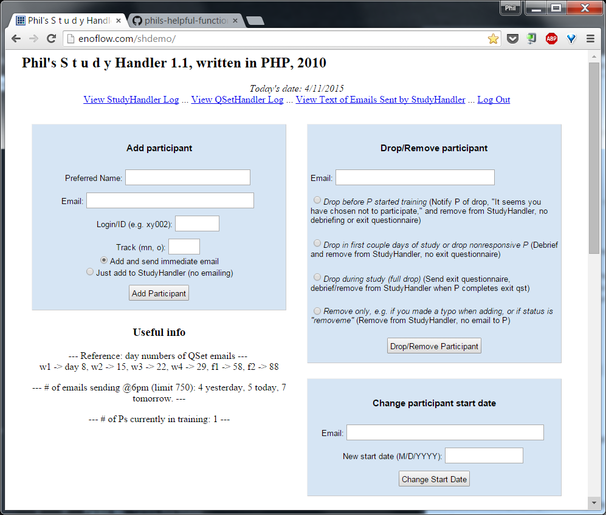
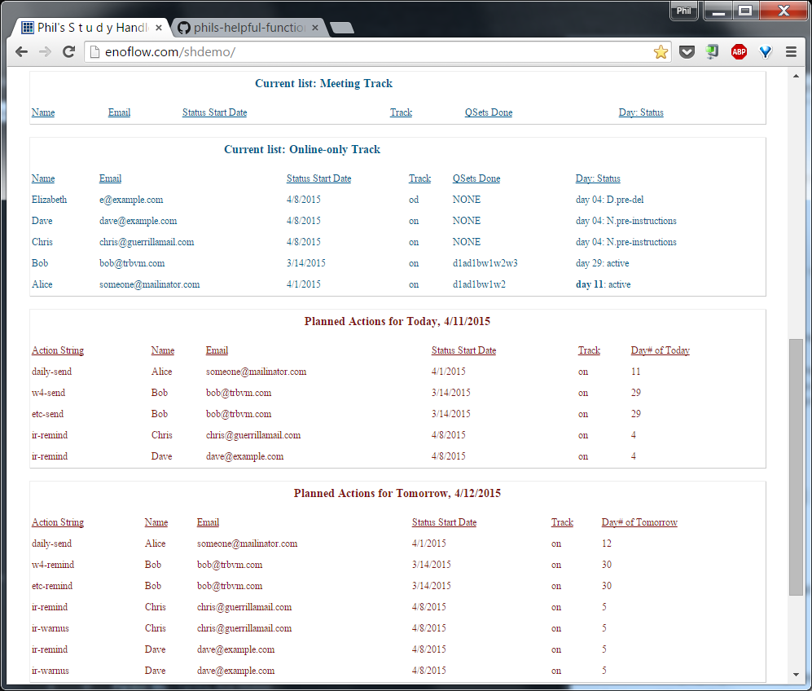

# StudyHandler
by Phil Enock, written summer 2010

## Experiment for which I created StudyHandler
StudyHandler was a totally functioning and useful system, though it was written for a specific purpose so it would need a lot of changes to generalize to a new purpose. It's a good proof of concept though in how to run a medium-sized online experiment over months and handle tons of emails and questionnaires.

I wrote StudyHandler from scratch in PHP (+ HTML, CSS) in the summer of 2010 in preparation for launching my online experiment in which participants/subjects did an experimental cognitive training exercise (called attentional bias modification) via smartphone intended to reduce severe, chronic social anxiety.

I published the findings in a peer-reviewed journal article ([PDF](https://dl.dropboxusercontent.com/u/11449376/papers/Enock-2014-smartphone-ABM.pdf)

It was also covered in this [New York Times article](http://www.nytimes.com/2012/02/14/health/feeling-anxious-soon-there-will-be-an-app-for-that.html) and other media outlets. Fun fact: Most of our 326 participants volunteered after hearing about the study in [The Economist](http://www.economist.com/node/18276234).

## Need for StudyHandler
Participants did 4 weeks of training on their smartphones, as well as weekly questionnaires on their computers, plus 1-month and 2-month follow-up after the training period.

I needed to make sure they received all the instructions, began the protocol, did the questionnaires every week, as well as the follow-ups, plus I wanted to send them daily emails to remind them to train.

I didn't want an army of research assistants to do this. With StudyHandler, I was able to run this study, interacting with over 300 participants, with the help of 2 research assistants.

My code (that is, StudyHandler, some online instructions and some other PHP relating to questionnaires) allowed a participant to go through the entire 3-month protocol without needing to interact with our staff. What we did was watch StudyHandler and intervene when someone had a question, stopped participating, or had technical issues on their end. The system ended up working incredibly well.

## Screenshots
Here are screenshots of the Admin page:

(The admin page was secured so only the research assistants and I had access to email addresses... now you see fake emails in there, of course. Password protection and file permissions were important to the security situation.)

## Components of the system
1. Admin page -- here, you can add or remove participants. It's also a view of the status of all participants and of StudyHandler's actions. It tells you what day number (since they started) each person is on, what their status is (such as whether they've started yet or are currently active in the study), as well as what questionnaires ("QSets") they've completed.

2. Daily run, sending a batch of emails at 6pm ET -- every day, my server (BlueHost) executed a cron job to send out whatever emails were due to be sent that day, based on where the participant was in the protocol and whether he/she was behind on due dates for questionnaire responses. StudyHandler knew how to send out every questionnaire they needed to complete, with a unique URL to each participant, so they didn't need to type in an ID.

3. Receiving notifications of participants' completing instructions and questionnaires -- StudyHandler would get notified (via code on my post-questionnaire landing page) whenever someone completed a questionnaire, so it could update their status and mark that one done.

4. Logs -- every action taken by StudyHandler was logged, so I could always go back and trace what had happened. It ended up running pretty flawlessly though, so they didn't turn out to be necessary.

## Files in this repository
The key file here with most of the code is: **index.php**
